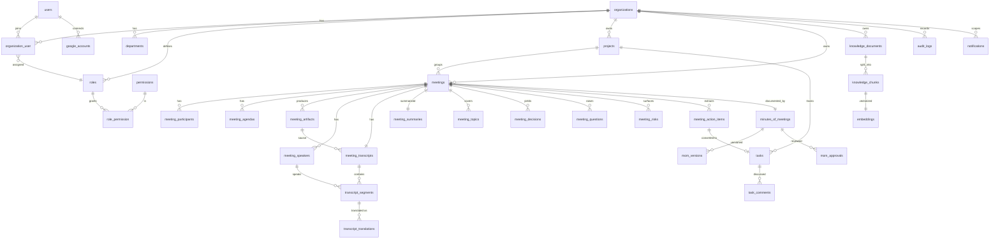

# AI Meeting Intelligence Platform — Architecture

This document records the system architecture and the reasoning behind the data
model. It is the companion to the migrations in `database/migrations/` and is
meant to be the reference the whole team builds against.

---

## 1. System shape

The platform is three deployable services with clear boundaries:

**Laravel API (PHP 8.4+).** The system of record and the only service the
frontend talks to. It owns authentication, authorization, tenancy, all business
data, Google API communication, queue orchestration, and document export. It
holds no long-running AI logic — it delegates that work and stores the results.

**React SPA (TypeScript + Vite).** A pure client of the Laravel API over REST
(Sanctum tokens). It never sees Google tokens, provider keys, or the AI service
directly.

**Python AI service (FastAPI).** A stateless worker-facing service that does the
heavy lifting: speech-to-text, diarization, language detection, translation, LLM
extraction, embeddings, and vector similarity. It exposes typed REST endpoints
(Pydantic in/out), is called only by Laravel queue workers over an internal
network, and authenticates with a shared service token. It stores nothing
authoritative — every result flows back to Laravel to persist.

```
React SPA ──REST(Sanctum)──▶ Laravel API ──Google APIs──▶ Calendar / Meet / Drive
                                  │
                             Database-backed queue
                                  │
                                  ▼
                        Laravel queue workers ──REST(service token)──▶ Python AI service
                                  │                                          │
                                  ▼                                    Whisper / LLM / embeddings
                              MySQL / PostgreSQL
```

The rule from the spec — *never run AI synchronously inside a web request* — is
structural here: the SPA has no path to the AI service, and Laravel only reaches
it from queued jobs.

---

## 2. The Google Meet reality (read this before Milestone 3)

The most load-bearing external assumption in the spec is that a finished Meet
produces a retrievable artifact. That is only true under specific conditions,
and the whole AI pipeline sits downstream of it, so it drives two design choices.

Programmatic access to Meet recordings and transcripts requires **Google
Workspace** (recording is a Business Standard+ / Enterprise feature), with
recording and transcription enabled by an admin, and the appropriate API scopes.
Recordings and Meet-generated transcripts land in the organizer's **Google
Drive**; the **Google Meet REST API** exposes conference records with links to
those Drive files. Personal `@gmail.com` accounts cannot record at all.

Two consequences baked into the schema:

1. **Ingestion is decoupled from processing.** `meeting_artifacts` is a first-class
   table with its own `source` (`google_meet` | `upload`) and `status`. The
   pipeline consumes artifacts; it does not care how they arrived.
2. **A manual-upload fallback is a first-class path, not an afterthought.** The
   same `meeting_artifacts` row can point at a Drive file *or* an uploaded audio
   file on your own storage disk. Organizations without Workspace recording still
   get the full intelligence pipeline by uploading audio.

Validate the Workspace/scope situation against your real target accounts before
building on step 9 of the Definition of Done.

---

## 3. Multi-tenancy and isolation

**Model: single database, shared schema, `organization_id` on every
tenant-scoped table.** This is the pragmatic default for a B2B SaaS at this
stage — simpler operations than database-per-tenant, and sufficient isolation
when enforced consistently. The schema already carries `organization_id`
(indexed, usually as the first column of a composite index) on every tenant
table, including denormalized copies on deep tables like `knowledge_chunks` and
`embeddings` so tenant filtering never requires a join.

**Enforcement is defense-in-depth, not a single check:**

- A global Eloquent scope (`BelongsToOrganization` trait) adds
  `where organization_id = <current>` to every query on tenant models, resolved
  from the authenticated user's active organization. This makes cross-tenant
  leakage the exception you have to opt into, not the default you have to
  remember to prevent.
- Route-model binding uses the public `ulid` column, never sequential IDs, so
  resource identifiers can't be enumerated across tenants.
- Policies (see §4) run on top of the scope for per-resource checks.
- The AI retrieval layer filters on `organization_id` **and** an authorized
  meeting set before any vector search runs (§6) — the scope alone is not
  trusted to protect AI answers.

Users belong to organizations **many-to-many** through `organization_user`. The
spec says "a user belongs to an organization," but the pivot plus real SaaS usage
(consultants, multi-org admins) makes membership many-to-many the safer model;
a user's role and department are properties of the *membership*, not the user.

---

## 4. Authentication and authorization

**Auth:** Laravel Sanctum (SPA token auth), Google OAuth as a social login and as
the Calendar/Meet integration, plus a 2FA-ready column set on `users`
(`two_factor_secret`, `two_factor_recovery_codes`, `two_factor_confirmed_at`).

**Authorization is permission-based, per the spec — roles are just bundles.**
`permissions` is a global catalogue (`meetings.view`, `mom.approve`,
`ai.search`, …). `roles` are org-scoped (`organization_id` NULL = a built-in
system role such as `super_admin`). `role_permission` wires them together, and a
member's role is assigned on `organization_user`. Code checks permissions
(`$user->can('mom.approve', $meeting)`), never role names — so an org can rename
or recompose roles without touching application logic.

The five named roles (Super Admin, Org Admin, Manager, Employee, Meeting
Organizer) ship as seeded permission sets. "Meeting Organizer" is partly
*relationship-derived* (you get organizer powers on meetings where you are the
organizer), which Policies express directly rather than as a static role.

> If you'd rather not hand-roll this, `spatie/laravel-permission` with its teams
> feature (team = organization) maps cleanly onto these tables and is the
> production default many Laravel shops reach for. The schema is intentionally
> compatible with that shape.

---

## 5. The AI pipeline

Processing is an **idempotent, resumable chain of queued jobs** using Laravel's
`database` queue driver, kicked
off when an artifact becomes available. Each job advances
`meetings.ai_processing_status` and the relevant child-record `status`, so the UI
can render the live stage view (§22, §58) straight from the database.

```
ArtifactReady
   → ValidateArtifactJob        (UPLOADED → QUEUED)
   → TranscriptionJob           (→ TRANSCRIBING)      writes meeting_transcripts + transcript_segments
   → LanguageDetectionJob                              annotates segment.language, transcript.detected_languages
   → DiarizationJob             (→ IDENTIFYING_SPEAKERS) writes meeting_speakers, links segments
   → TranscriptCleaningJob
   → TranslationJob             (→ TRANSLATING)        writes transcript_translations (originals untouched)
   → TopicExtractionJob         (→ ANALYZING)
   → SummaryJob                 (→ GENERATING_SUMMARY) writes meeting_summaries
   → DecisionExtractionJob                             writes meeting_decisions
   → ActionItemExtractionJob    (→ EXTRACTING_ACTIONS) writes meeting_action_items (status=suggested)
   → RiskAndQuestionJob                                writes meeting_risks, meeting_questions
   → MoMGenerationJob           (→ GENERATING_MOM)     writes minutes_of_meetings (status=ai_generated) + v1
   → EmbeddingJob               (→ INDEXING)           writes knowledge_chunks + embeddings
   → FinalizeJob                (→ COMPLETED)
```

Design properties:

- **Every job is retryable and checkpointed.** Because each writes its own rows
  and flips a status, a failure resumes from the last completed stage instead of
  reprocessing audio from scratch. `FAILED` is a terminal state the UI surfaces
  with a retry action (§51).
- **Extraction is separated from persistence.** The Python service returns
  structured JSON; Laravel validates it against a schema before writing. The AI
  service never touches the database.
- **AI output is staged, not authoritative.** Action items land as `suggested`
  and become `tasks` only on human acceptance (§25). MoM lands as `ai_generated`
  and is distributed only after `approved` (§28). The data model enforces the
  human-in-the-loop the spec asks for.

**No Redis in this deployment.** Queue, cache, and session all run on
zero-additional-infra drivers — `database` for the queue (via the
`jobs`/`job_batches`/`failed_jobs` migration), `file` for cache and sessions.
This keeps the only required infrastructure to Postgres, and the async
guarantee — AI work is never processed inline in a web request — holds exactly
the same way it would with Redis. If throughput ever demands it, swapping the
queue connection to Redis or SQS is a config change, not a code change: every
job already goes through Laravel's queue abstraction.

---

## 6. Grounding, citations, and hallucination control

This is treated as a schema concern, not a prompting afterthought.

- **Millisecond timestamps everywhere.** `transcript_segments.start_ms/end_ms`
  and a `source_timestamp_ms` on decisions, action items, risks, questions, and
  tasks. Every extracted item can deep-link to the exact transcript moment
  (§53), and "click source → jump to timestamp" is a straight lookup.
- **Explicit confidence.** `ai_confidence` (low/medium/high) on extracted
  records, plus a dedicated `due_date_confidence` so an uncertain "Friday" is
  flagged rather than turned into a fabricated date (§52).
- **Originals are immutable.** Translations never overwrite source text — they
  live in `transcript_translations` keyed by target language (§23).
- **Retrieval is authorization-first.** `knowledge_chunks` and `embeddings` carry
  `organization_id` and `meeting_id`. The assistant/search flow resolves the
  caller's authorized meeting set first, then restricts the vector query to those
  IDs — so AI can never answer from a meeting the user can't open (§25, §40).

---

## 7. Vector search

Semantic search and the assistant use embeddings over `knowledge_chunks`.

**Recommended: PostgreSQL + pgvector.** The `embeddings` migration creates the
`vector` extension, a real `vector(1536)` column, and an HNSW cosine index. This
is the mature, in-database path and keeps retrieval a single tenant-scoped SQL
query.

**MySQL fallback.** If you must run MySQL, the migration stores vectors as JSON
(`vector_json`) and similarity is delegated to the Python service or an external
vector store (e.g. Qdrant/pgvector-as-a-service). The application code path is
the same; only the similarity implementation swaps. Given vector search is a hard
requirement, **PostgreSQL is the recommended default** for this platform.

`dimensions`/`model` are stored per row so you can migrate embedding models
without a schema change.

---

## 8. Key decisions at a glance

- **Dual identifiers.** `bigIncrements` primary keys for compact, fast internal
  FKs; a unique `ulid` on every user-facing resource for route binding and API
  exposure. You get join performance without leaking counts or enabling
  enumeration.
- **Status/enum fields are strings, cast to PHP enums in the model** rather than
  DB `ENUM` columns — adding a new status is an app change, not a migration.
  Allowed values are documented inline in each migration.
- **Soft deletes** on user-authored and retention-sensitive entities
  (organizations, users, meetings, projects, decisions, MoM, tasks, documents);
  hard cascade on tightly-owned children (segments, participants, chunks).
- **`audit_logs` is append-only** (no `updated_at`), immutability enforced at the
  application layer.
- **Retention lives on `organizations`** (`transcript_retention_days`,
  `recording_retention_days`, AI toggles) so a scheduled prune job can honor
  per-tenant privacy policy (§41).

---

## 9. Data model overview

Thirty-four tables across seven domains. Relationships at a glance:



Domain groupings:

1. **Tenancy & identity** — organizations, users, departments, roles,
   permissions, role_permission, organization_user, google_accounts.
2. **Meetings** — projects, meetings, meeting_participants, meeting_agendas.
3. **Ingestion** — meeting_artifacts, meeting_speakers.
4. **Transcription** — meeting_transcripts, transcript_segments,
   transcript_translations.
5. **Intelligence** — meeting_topics, meeting_summaries, meeting_decisions,
   meeting_questions, meeting_risks, meeting_action_items.
6. **MoM & tasks** — minutes_of_meetings, mom_versions, mom_approvals, tasks,
   task_comments.
7. **Platform** — notifications, audit_logs, knowledge_documents,
   knowledge_chunks, embeddings.

Plus Laravel's own tables (`sessions`, `cache`, `jobs`, `job_batches`,
`failed_jobs`, `personal_access_tokens`) which the framework's default
migrations create.

---

## 10. Secrets and configuration

Everything sensitive comes from `.env` and is never shipped to the client:
Google OAuth client ID/secret, the AI-service base URL and shared service token,
and provider keys (which live only on the Python service). Google access and
refresh tokens are stored in `google_accounts` under Laravel's `encrypted` cast.
The SPA receives only what a Sanctum-authenticated API response exposes.

---

## 11. What's in this deliverable, and what's next

**In this drop:** the full relational schema — 34 tables as validated Laravel
migrations (`php -l` clean, FK order verified) — plus this architecture record.

**Natural next steps, in build order (matches the spec's milestones):**

1. **Eloquent models + the tenancy layer** — the `BelongsToOrganization` global
   scope, `HasUlid` trait, enum casts, and relationships. This is what makes the
   schema *usable* and is the highest-leverage next artifact.
2. **RBAC seeder** — permission catalogue + the five default roles.
3. **Milestone 1 backend** — auth (Sanctum + Google), org/user/membership CRUD,
   Form Requests, Policies, API Resources.
4. **Python AI service skeleton** — FastAPI app with typed request/response
   contracts for each pipeline stage, so Laravel and the AI service can be built
   against a shared interface.

Tell me which of these to generate next and I'll build it to the same standard.
